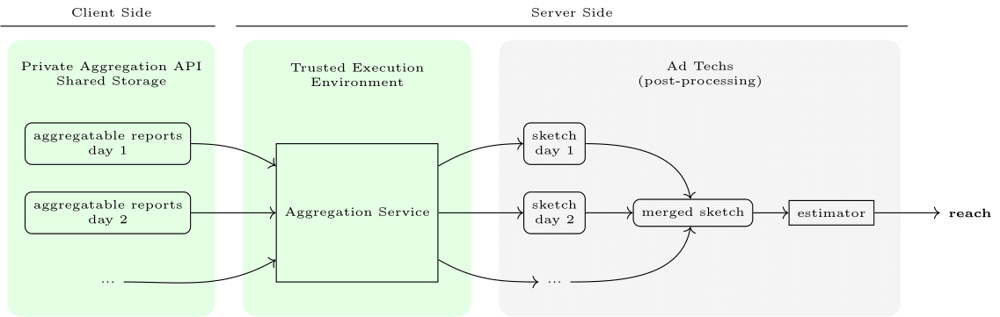
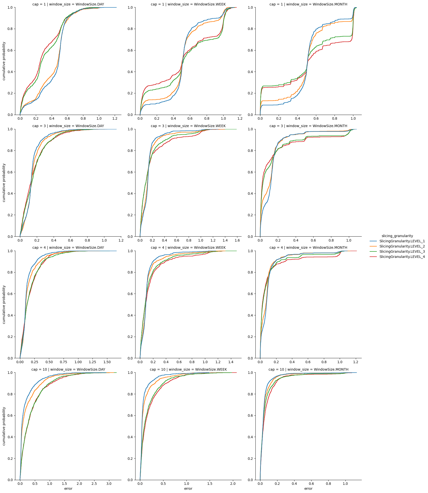
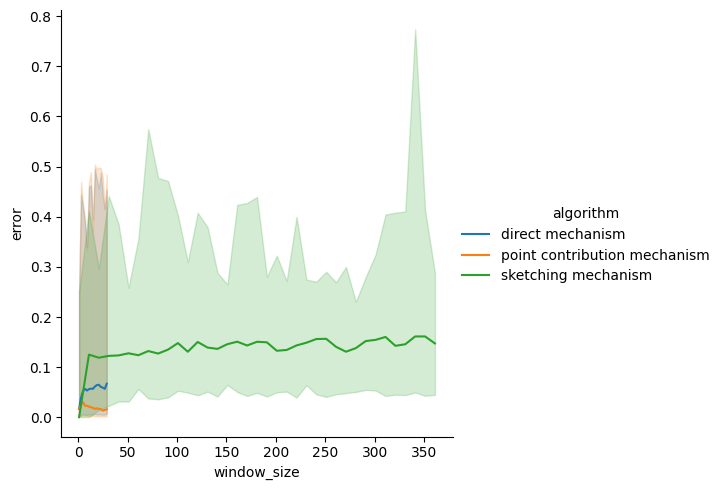

# Reach Implementation Best Practices in the Privacy Sandbox Shared Storage + Private Aggregation APIs

This whitepaper aims to provide ad tech companies with actionable guidance on
implementing reach measurement within the Privacy Sandbox, via the
[Shared Storage](https://developers.google.com/privacy-sandbox/relevance/shared-storage) 
and
[Private Aggregation](https://developers.google.com/privacy-sandbox/relevance/private-aggregation) APIs.
We dive into various reach scenarios, covering hierarchical queries, cumulative
reach, and present corresponding implementation strategies, catering to diverse
ad tech requirements.

In various use cases, we recognize the potential utilization of exploratory
reach queries.
Taking into account the various needs of advertising technology companies,
we consider both scenarios: pre-determined reach queries (queries known in
advance) and ad hoc or unknown reach queries.
Hence, this work presents an exploration of alternative approaches, 
including direct measurement and 
[sketch-based mechanisms](#sketch-based-methods). 
Through empirical evaluation on synthetically generated data, modeled after 
real-world ad datasets, we assess the impact of factors like ad event capping, 
query granularity, and time windows on measurement accuracy. We aim to equip 
ad tech companies with the insights needed to select the best reach measurement 
method aligned with their specific query characteristics and privacy 
considerations.

Our experiments show that for predetermined queries, the best solution is to use
the point contribution mechanism. However for more exploratory queries or those
with longer windows, sketch-based mechanisms are beneficial although techniques
such as capping may need to be used to reduce error.

By shedding light on reach estimation using the Privacy Sandbox, this paper 
seeks to empower ad tech companies to navigate the evolving landscape of 
privacy-centric advertising technologies.


## Reach Functionality

The goal of reach is to compute the number of unique users that see (or interact
 with) content (e.g., a specific ad).
 For the purpose of this white paper, we will treat each browser profile as a
 unique user, so that the result is actually the number of unique profiles that
see the content.
We use this definition for simplicity in our empirical evaluations.
Therefore, we will use “user” and “browser profile” interchangeably.

In general, an ad tech would like to perform multiple reach measurements
depending on how they wish to “slice” the set of users.
In the context of digital advertising, a slice is defined as a distinct segment
of a campaign's target audience, characterized by specific attributes or
behaviors. This segmentation allows granular analysis and targeted optimization
of advertising efforts. Slices can be constructed based on a variety of
dimensions like campaign, location, demographics etc.  For example, one may
want to perform a reach measurement for a single campaign during a single day;
or to perform a reach measurement for a single campaign during a single day for
a specific geographic region.

Within a specified time window, reach between slices is not necessarily
additive. 
In other words, the count of all users for `campaign=123` is equal to the sum of
user counts of `campaign=123` for each geolocation, only if no user appears in
two different geo areas, which is not always the case.
For features such as a creative ID, a user may view advertisements with multiple
creative IDs, thus additivity does not apply in this scenario either.
Consequently, when queries are pre-determined, it is important to explicitly
define each inquiry and collect relevant contributions.
Conversely, when queries are unknown, contributions must be collected to support
the finest granularity of queries.

<span id="level">Throughout this paper</span>, we consider hierarchical reach 
measurement queries, based on different slices. 
For illustration and experimentation purposes, we assume the following four 
slicing levels:


*   Level 1 (coarsest): advertiser
*   Level 2: advertiser x campaign
*   Level 3: advertiser x campaign x geo
*   Level 4 (finest): advertiser x campaign x geo x ad strategy x creative

To analyze the temporal aspects of reach, let's consider the following 
definitions for a running campaign:


*   Cumulative Reach: This quantifies the number of unique users exposed to
  impressions within a campaign since its inception. In this scenario, we
  incrementally measure reach over time.
    *   Example queries: Reach until January 24th, Reach until January 25th,
      Reach until January 26th, etc.

    _Note that we are not considering rolling window queries here for brevity;
    however, the approaches we consider for cumulative reach could be 
    generalized to this use case._

*   Fixed Window Reach: This calculates the number of unique users exposed
  to impressions within a specific time range. The time range, or window, is 
  determined at the time of data collection and remains constant during 
  subsequent analysis.
    *   Example queries: Reach between January 22nd and January 24th, Reach
      between January 23rd and January 25th, etc.

    The following query examples were selected for pre-determined queries due to
    their relevance to real-world scenarios and frequent usage within ad tech
    analytics.


<table>
  <tr>
   <td style="background-color: #cccccc">
ID
   </td>
   <td style="background-color: #cccccc">Query
   </td>
   <td style="background-color: #cccccc">Query Frequency
   </td>
   <td style="background-color: #cccccc">Type
   </td>
  </tr>
  <tr>
   <td>Q1
   </td>
   <td>What is the reach for the last day?
   </td>
   <td>Queried every day
   </td>
   <td>Fixed Window
   </td>
  </tr>
  <tr>
   <td>Q2
   </td>
   <td>What is the reach for the last calendar week?
   </td>
   <td>Queried every week
   </td>
   <td>Fixed Window
   </td>
  </tr>
  <tr>
   <td>Q3
   </td>
   <td>What is the reach for the last month?
   </td>
   <td>Queried every month
   </td>
   <td>Fixed Window
   </td>
  </tr>
  <tr>
   <td>QC
   </td>
   <td>What is the cumulative reach till now?
   </td>
   <td>Queried every day
   </td>
   <td>Cumulative
   </td>
  </tr>
</table>


## Reach Implementations

First, we show that reach can be measured directly using the existing Shared 
Storage and Private Aggregation APIs – we call this approach a direct method.
Next, we explain how sketch-based methods can be used with the same APIs.


### Single Reach Measurement in Shared Storage + Private Aggregation APIs

We start by recalling how to compute a single reach measurement via Shared
Storage, as described in the
[developer documentation](https://developers.google.com/privacy-sandbox/relevance/shared-storage/unique-reach).
The idea is to use Shared Storage to record whether this browser has already
contributed to the reach measurement for the slice.
If it has, then we do nothing.
Otherwise, we contribute to the histogram (with a single bucket) and record that
a contribution has been made in Shared Storage.
In doing so, the computed reach is simply equal to the aggregated value.
For convenience, the following code snippet is adapted from the above linked
documentation.


```javascript
const L1_BUDGET = 65536;

// contentId here is some id of the interaction that is measured;
// i.e., it is a campaign id.
function convertContentIdToBucket(contentId) {
  return BigInt(contentId);
}

class ReachMeasurementOperation {
  async run(data) {
    const { contentId } = data;

    // Read from Shared Storage
    const key = 'has-reported-content';
    const hasReportedContent = (await sharedStorage.get(key)) === 'true';

    // Do not report if a report has been sent already
    if (hasReportedContent) {
      // Note that this would happen if less than 30 days 
      // passed since the first visit.
      return;
    }

    // Generate the aggregation key and the aggregatable value
    const bucket = convertContentIdToBucket(contentId);
    const value = 1 * L1_BUDGET;

    // Send an aggregatable report via the Private Aggregation API
    privateAggregation.contributeToHistogram({ bucket, value });

    // Set the report submission status flag
    await sharedStorage.set(key, true);
  }
}
```


Note that the reach result can be computed by taking the aggregated histogram
value of each key and dividing by the contribution budget (`L1_BUDGET)`.
Note that the developers website uses a scale factor (`SCALE_FACTOR`), but in
this example the scaling factor is the same as the contribution budget so we
use `L1_BUDGET`.
See the
[“Noise and scaling” section](https://developers.google.com/privacy-sandbox/relevance/private-aggregation/fundamentals#noise_and_scaling) 
of the Private Aggregation fundamentals article to learn more.


### Single Reach Measurement with Capping

An implicit assumption in the previous section is that each 
[privacy unit](https://www.google.com/url?q=https://github.com/patcg-individual-drafts/private-aggregation-api?tab%3Dreadme-ov-file%23implementation-plan&sa=D&source=docs&ust=1715709807432613&usg=AOvVaw2F52S_hQoFFfN3FjYLRq18) 
– i.e., &lt;browser x reporting origin ad tech x 10 minutes> – 
contributes to only a single query. 
The reason is that (i) the Shared Storage check does not incorporate the bucket
so even if a later content tries to contribute to the same report, it will not
pass the check and (ii) the value contribution is 65,536 which is the same as
the overall contribution budget (see 
[contribution budget for summary reports](https://developers.google.com/privacy-sandbox/relevance/private-aggregation/fundamentals#contribution_budget)). 
In other words, we “cap” the number of contributions each privacy unit can make
to just one. 
In many cases, multiple contributions from a single privacy unit may be dropped
due to a capping limit of 1. 
This can lead to poor utility, as each privacy unit's contributions are not
fully reflected in the results. 

To improve utility, we can increase the contribution cap to an arbitrary number
we wish (denoted by `CONTRIBUTION_CAP` below).
Allowing a larger cap can capture more contributions, which is good for utility.
However, it also results in a larger amount of noise (after scaled down by
`L1_BUDGET / CONTRIBUTION_CAP`) which is worse for utility. 
As such, the capping parameter has to be tuned carefully. 

We give an example code below where the capping parameter is set to five. 
The two changes are (i) making the Shared Storage checks for the specific bucket
and (ii) dividing each contribution value by the capping parameter.
These changes are highlighted in light yellow.


```javascript
const CONTRIBUTION_CAP = 5;
const L1_BUDGET = 65536;

function convertContentIdToBucket(contentId) {
  return BigInt(contentId);
}

class ReachMeasurementOperation {
  async run(data) {
    const { contentId } = data;

    // Generate the aggregation key and the aggregatable value
    const bucket = convertContentIdToBucket(contentId);
    const value = Math.floor(L1_BUDGET / CONTRIBUTION_CAP);

    // Read from Shared Storage
    const key = `has-reported-content-${bucket}`;
    const hasReportedContent = (await sharedStorage.get(key)) === 'true';

    // Do not report if a report has been sent already for this bucket
    if (hasReportedContent) {
      return;
    }

    // Send an aggregatable report via the Private Aggregation API
    privateAggregation.contributeToHistogram({ bucket, value });

    // Set the report submission status flag
    await sharedStorage.set(key, true);
  }
}
```


### Multiple Reach Measurements with Capping

While the above method focuses on a scenario where each content can contribute
to only a single reach measurement (i.e., a single “query”), it can be extended
to the case where each content can contribute to multiple reach measurements by
having a key for each query. 

Below, we give an example of this for the hierarchical queries described above.
Note that each reached browser (i.e., first time the advertisement is shown to
the user) contributes to exactly one slice in each
[level](#level).
Thus, the number of histogram keys that each reached content contributes to is
equal to the number of levels.
Due to the
[contributions budget](https://developers.google.com/privacy-sandbox/relevance/private-aggregation/fundamentals#contribution_budget)
constraint, the scale factor is now divided by the number of levels in addition
to dividing it by the contribution cap (`CONTRIBUTION_CAP`). 
While we adhere to equal contribution per level, it is possible to further
optimize the contribution budget across different levels, as explained in the
[relevant paper](https://arxiv.org/pdf/2308.13510).  

The code for this is below.


```javascript
const CONTRIBUTION_CAP = 5;
const NUM_LEVELS = 4;
const L1_BUDGET = 65536;

function convertContentIdAndLevelToBucket(contentId, level, ...otherDimensions) {
  // Implement a function that computes the bucket key for a given level using 
  // level-related fields from otherDimensions.
  // E.g., in our example, the second level could set the key to be the concatenation
  // between advertiser and campaign id of this content.
}
class ReachMeasurementOperation {
  async run(data) {
    const { contentId, ...otherDimensions } = data;

    for (let level = 1; level <= NUM_LEVELS; level++) {
      // Generate the aggregation key and the aggregatable value
      const bucket = convertContentIdAndLevelToBucket(contentId, level, ...otherDimensions);
      const value = Math.floor(L1_BUDGET / (CONTRIBUTION_CAP * NUM_LEVELS));

      // Read from Shared Storage
      const key = `has-reported-content-${bucket}`;
      const hasReportedContent = (await sharedStorage.get(key)) === 'true';

      // Do not report if a report has been sent already
      if (hasReportedContent) {
        return;
      }

      // Send an aggregatable report via the Private Aggregation API
      privateAggregation.contributeToHistogram({ bucket, value });

      // Set the report submission status flag
      await sharedStorage.set(key, true);
    }
  }
}

// Register the operation
register('reach-measurement', ReachMeasurementOperation);
```


A sample call would look like:


```javascript
await window.sharedStorage.run('reach-measurement', { data: {
    contentId: '123', 
    geo: 'san jose', 
    creativeId: '55' 
}});
```


### Cumulative Reach Measurements

So far, we have not mentioned the time aspect of the queries. 
In particular, we assume that all queries correspond to the same time periods. 
However, we may want to measure time-related queries. 
A popular family of such queries is cumulative queries, which are queries of 
the form “what is the total reach up until timestep `t`?” where 
`t` varies from `1, …, T`.
For example, one might want to measure the reach up until today everyday for the
 entire month. In this case, we would have `T = 30` and “timestep” being a day.

_Note: Both methods described in this section are limited by the 
[retention policy](https://github.com/WICG/shared-storage?tab=readme-ov-file#data-retention-policy) of Shared Storage which is 30 days from last write._


#### Direct Method

For cumulative reach queries, we can naively apply the direct method above by 
adding the timestamp to the key of the histogram. 
If a user is reached at time step $`i`$, then contributions would be made to all 
of $`i, \dots, T`$ buckets. 
Since there are $`T`$ queries, the noise will scale by a factor of 
$`O(T / \epsilon)`$.
Note that with the current API, one would need to wait until the last window to
obtain the results since reprocessing of the reports is not currently supported.


#### Point Contribution

We can improve upon the above direct method by a simple modification. 
For simplicity, we only discuss the mechanism (and give the code) for
the single-query cap-one case. 
It is easy to extend this to the multi-query case by appending the query id to 
the keys. 
Before we describe the mechanism, let us first make the following observation. 
Consider the number $`n^{(\text{new})}_i`$ of users that were reached for the 
first time at timestep $`i`$. 
The answer of cumulative reach up to timestep $`t`$ is exactly equal to the 
cumulative sum $`\sum_{i=1}^t n^{(\text{new})}_i`$. 
Using this fact, we can simply create $`T`$ buckets, where bucket $`i`$ corresponds 
to $`n^{(\text{new})}_i`$. 
When we wish to compute the cumulative reach up to time step $`i`$, we take the 
sum of the first $`i`$ buckets. Since each user contributes to only a single
bucket, each bucket’s noise standard deviation is only $`O(1 / \epsilon)`$.
Since we are summing up to $`T`$ such (independent) noises, the total noise 
standard deviation is $`O(\sqrt{T} / \epsilon)`$, which is an improvement of
$`O(\sqrt{T})`$ over the direct method.

An implementation in Shared Storage is given below. 


```javascript
// Time horizon T
const TIME_HORIZON = 30;
const L1_BUDGET = 65536;

function convertContentIdToBucket(contentId, currentTime) {
  // This key corresponds to n_i as described above with i = currentTime.
  // Note that the remainder of "bucket" when divided by TIME_HORIZON
  // is currentTime and the quotient is contentId; hence, this formula gives a 
  // unique id to each pair of contentId and currentTime.
  return TIME_HORIZON * BigInt(contentId) + currentTime;
}

class ReachMeasurementOperation {
  async run(data) {
    const { contentId } = data;

    // Read from Shared Storage
    const key = 'has-reported-content';
    const hasReportedContent = (await this.sharedStorage.get(key)) === 'true';

    // Do not report if a report has been sent already
    if (hasReportedContent) {
      return;
    }

    // Should be appropriately set by the ad tech (e.g., based on hour or day)
    const currentTime;
  
    // Increment the current bucket
    const bucket = convertContentIdToBucket(contentId, currentTime);
    const value = L1_BUDGET;

    // Send an aggregatable report via the Private Aggregation API
    privateAggregation.contributeToHistogram({ bucket, value });

    // Set the report submission status flag
    await this.sharedStorage.set(key, true);
  }
}
```


The code for computing cumulative reach from the aggregated histogram is given
below.


```python
# Time horizon T; needs to be fixed beforehand
TIME_HORIZON = 30;
L1_BUDGET = 65536.0;


def convert_content_id_to_bucket(content_id: int, current_time: int) -> int:
    # Same as the client-side function above.
    return TIME_HORIZON * content_id + current_time;

def compute_cumulative_reach(
    aggregated_histogram: dict[int, int],
    content_id: int) -> dict[int, int]:
  """Compute cumulative reach for the given content_id.

  Args:
    aggregated_histogram: a mapping from key to aggregated value n the summary 
      report output by the Aggregation Service.
    content_id: the content id for which the cumulative reach is computed.

  Returns:
    a mapping from time step to the cumulative reach up until that time step.
  """
  res = {}
  for t in range(TIME_HORIZON):
    res[t] = 0
    for i in range(1, t + 1):
      key = convert_content_id_to_bucket(content_id, i)
      res[t] += aggregated_histogram[key] / L1_BUDGET
  return res
```


Finally, we remark that, for larger values of T (which may be the case if
measuring cumulative reach on granularities less than one day), there are more
advanced mechanisms that can reduce the error further 
[[1](#private-decayed-sums),[2](#private-counting)],
but this is beyond the scope of this paper.


### Sketch-Based Methods

Sketching is a technique for estimating the reach (and other quantities of 
interest) using compressed aggregated data structure admitting merge operation.
Here we only consider one of the most basic families of sketches, called 
[counting bloom filters (CBFs)](https://en.wikipedia.org/wiki/Counting_Bloom_filter). 
In this case, we have a hash function $`h`$ that maps any user ID to one of $`m`$ 
buckets. 
The CBF sketch is simply the histogram on these $`m`$ buckets among all the 
reached users. 
We can estimate the reach based on the number of non-empty buckets in the 
sketches. 
The exact formula for this estimation is based on the hash function 
distribution.

The main advantage of this sketch is that it can be merged: if we have two CBFs,
summing them up gives us the CBF corresponding to the union of the two
(multi)sets.
This allows us to be more flexible when answering queries.
Recall that, in the direct method, we need to know all the queries beforehand
since we need to allocate each bucket and each query. 
This is not needed when using sketches: We can simply create a sketch for each
fine-grained unit (e.g. the reach for each day) and, when we make a query for a
day range, we take the union of all the sketches in that range.
This means that the analyst can supply the queries in an on-demand fashion,
which is more convenient. Moreover, sketching methodology offers another 
significant advantage: the ability to deduplicate user IDs across multiple 
devices, providing a more accurate picture of individual engagement. 
This would typically require using the same user ID on multiple devices. 
Shared Storage is partitioned per browser, so the ad tech would need to identify
the user across devices independently. Alternatively, there are modeling-based
approaches (e.g. 
[virtual people](https://research.google/pubs/virtual-people-actionable-reach-modeling/))
that would avoid the need for these
IDs to map directly to real-world users.

Nevertheless, there are also several disadvantages of this sketch.
Firstly, each sketch is a histogram with $`m`$ buckets.
In contrast, the direct method only outputs a single number per query.
Therefore, the sketching method can result in a memory usage overhead during
processing of the aggregatable reports and during post-processing of the summary
reports compared to the direct or point contribution methods.
Secondly, since the noise is added to every entry of the sketch, this can lead
to inaccurate estimates if the noise is large.
Specifically, as we will see below, we need to set the capping parameter to be
small to ensure the noise is small but doing so results in a large error due to
capping. 
This tension means that we have to be very careful in terms of parameter 
settings to ensure (reasonably) accurate estimates.

The overall scheme of the reach estimation involving sketches is described on 
the following diagram.




We remark that there are many other types of sketches beyond counting bloom 
filters (CBFs), such as 
[(boolean) bloom filters](https://en.wikipedia.org/wiki/Bloom_filter); 
and even CBF’s could use different hashes with different distributions of 
values. 
In this paper, we only focus on uniform CBFs since they are histograms and thus
most compatible with the API and change of the distribution didn’t change the
experimental errors in our dataset. 
However, it is plausible that other types of
sketches can allow for better utility.

As the sketch is simply a histogram, it is simple to implement via the Shared
Storage and Private Aggregation APIs. 
Again, for simplicity, we only include the code snippet for the cap-one case
below. (Note that if there are many different content ids, one might consider 
splitting them into groups using 
[filtering ID’s](https://www.google.com/url?q=https://github.com/patcg-individual-drafts/private-aggregation-api/blob/main/flexible_filtering.md&sa=D&source=docs&ust=1717257234668602&usg=AOvVaw01fIhnBOOZisrNsyNBMHqm).)


```javascript
// Sketch size m
const SKETCH_SIZE = 10000
const L1_BUDGET = 65536;

function sketchHash(userId) {
  // Should output a number in 0, ..., SKETCH_SIZE - 1 based on which bucket of 
  // the sketch the user id is hashed to.
}

function convertContentIdToBucket(contentId, userId) {
  // Note that the remainder of convertContentIdToBucket when divided by 
  // SKETCH_SIZE is sketchHash(userId) and the quotient is contentId; hence, 
  // this formula gives a unique id to each pair of contentId and 
  // sketchHash(userId).
  return SKETCH_SIZE * BigInt(contentId) + sketchHash(userId);
}

class ReachMeasurementOperation {
  async run(data) {
    const { contentId } = data;

    // Read from Shared Storage
    const key = 'has-reported-content';
    const hasReportedContent = (await sharedStorage.get(key)) === 'true';

    // Do not report if a report has been sent already
    if (hasReportedContent) {
      return;
    }

    // Generate the aggregation key and the aggregatable value
    const userId = getUserId();
    const bucket = convertContentIdToBucket(contentId, userId);
    const value = 1 * L1_BUDGET;

    // Send an aggregatable report via the Private Aggregation API
    privateAggregation.contributeToHistogram({ bucket, value });

    // Set the report submission status flag
    await sharedStorage.set(key, true);
  }
}
```


After aggregation, each content id will have a sketch associated with it.
To estimate the reach given sketches the following algorithm can be used.


```python
import numpy as np

def _invert_monotonic(
    f: Callable[[float], float], lower: float = 0, tolerance: float = 0.001
) -> Callable[[float], float]:
    """Inverts monotonic function f."""
    f0 = f(lower)

    def inversion(y: float) -> float:
        """Inverted f."""
        assert f0 <= y, (
            "Positive domain inversion error."
            f"f({lower}) = {f0}, but {y} was requested."
        )
        left = lower
        probe = 1
        while f(probe) < y:
            left = probe
            probe *= 2
        right = probe
        mid = (right + left) / 2
        while right - left > tolerance:
            f_mid = f(mid)
            if f_mid > y:
                right = mid
            else:
                left = mid
            mid = (right + left) / 2
        return mid

    return inversion

def _get_expected_non_zero_buckets(
   bucket_probabilities: list[float],
) -> Callable[[int], float]:
   """
   Create a function that computes the expected number of non-zero buckets.

   Args:
       bucket_probabilities: A list of probabilities of each bucket
           being selected when a user is added to a sketch.
   Returns:
       A function that given the number of users, returns the expected number of
       non-empty buckets.
   """
   def internal(count: int):
       return sum(
                1 - pow(1 - p, count)
                for p in bucket_probabilities
            )
   return internal


def estimate_reach(
    sketches: list[list[int]], 
    bucket_probabilities: list[float],
) -> float:
    """
    Estimate reach given the sketches.

    Args:
        sketches: the list of sketches, where each element of a sketch is an 
            element of the histogram.
        bucket_probabilities: probability of a given bucket being chosen for a
            user; for uniform CBF's all the values are the same, for exponential
            CBF ith element has value `alpha ** i` for some fixed value alpha.
    """
    sketches = np.array(sketches)
    
    thresholded_sketches = (sketches >= 0.5).astype(int)
    merged_sketch = thresholded_sketches.sum(axis=0)
    thresholded_merged__sketch = (merged_sketch >= 0.5).astype(int)
    non_zero_buckets_count = thresholded_merged__sketch.sum()

    estimator = _invert_monotonic(
        _get_expected_non_zero_buckets(bucket_probabilities), 
        lower=0, 
        tolerance=1e-7,
    )

    return estimator(non_zero_buckets_count)
```


## Empirical Evaluation


### Data

Due to privacy concerns, in this paper, we choose to evaluate errors on
synthetic data.
Working on real ad datasets, we find out that the reach on datasets can be
modeled in the following way. Reach for one day follows
[power-law distribution](https://arxiv.org/pdf/2311.13586) with shape parameter
$b$. 
When analyzing different datasets based on the different query or various slice
definitions, such as hierarchical queries, we noticed a consistent pattern.
Specifically, these datasets exhibit a power-law distribution, albeit with
differing shape parameters. 
In our observations, it was noted that capping on the client side does not
affect the shape of the power-law distribution, indicating that campaign
impressions are dropped by capping with equal probability.
In contrast, capping does have a significant impact on the volume reports from
clients.
The rate of reports dropped by capping, i.e., the capping discount rate, follows
a power-law distribution with respect to the capping value.
Figure 2 displays a representative discount rate versus capping plot and
corresponding curve fitting.

Furthermore, we examined the impact of the time window on the reach. Reach does
not demonstrate a linear relationship with time window size.
Instead, it exhibits a diminishing return compared to linear growth as
illustrated in Figure 3. 
This discount follows a power-law function relative to the size of the time
window.


```python
def sample_slices(
   number_of_days,
   cap,
   dataset_power_law_shape,
   n_samples
) -> list[SliceSize]:
"""Generates a synthetic dataset in slices (tuples of capped and uncapped numbers).


 Args:
   number_of_days: what time window the query is using.
   cap: the maximal number of slices a user might contribute.
   dataset_power_law_shape: dataset specific power-law shape param.
   n_samples: number of slices to generate. 
 """


  # sample reach distribution from power-law distribution. 
  reach_1_day = sample_discrete_power_law(
    b=dataset_power_law_shape, 
    n_samples=n_samples,
    ...)
  # approximate impact of capping.
  # compute probability of being reported (success, not impacted by capped) 
  # after capping.
  p_reported = (1 - cap_discount_rate(cap=cap))
  # for a slice of true size n, each contribution has p_reported probability to
  # be reported. Thus after capping, observed contributions become 
  # np.random.binomial(n, p) (there may be faster approximations) 
  reach_1_day_capped =  np.random.binomial(reach_1_day, p_reported)


  # approximate impact of time window
  reach_n_days = reach_1_day * number_of_days * window_discount_rate(number_of_days)
  reach_n_days_capped = reach_1_day_capped * number_of_days * window_discount_rate(number_of_days)


  # round to nearest int 
  reach_n_days = np.round(reach_n_days).astype(int)
  reach_n_days_capped = np.round(reach_n_days_capped).astype(int)


  return [
    (uncapped, capped) 
    for uncapped, capped in zip(reach_n_days, reach_n_days_capped)
  ]
```


Listing 1: pseudocode to generate synthetic data. 


<table>
  <tr>
   <td style="background-color: #cccccc">
    Level
<p>

    (granularity)
   </td>
   <td style="background-color: #cccccc">
    Query dimensions
   </td>
   <td style="background-color: #cccccc">
    Power law shape (b) param \
# reach per bucket
   </td>
  </tr>
  <tr>
   <td>1 (coarsest)
   </td>
   <td>advertiser
   </td>
   <td>1.01
   </td>
  </tr>
  <tr>
   <td>2
   </td>
   <td>advertiser x campaign
   </td>
   <td>1.10
   </td>
  </tr>
  <tr>
   <td>3
   </td>
   <td>advertiser x campaign x geo
   </td>
   <td>1.50
   </td>
  </tr>
  <tr>
   <td>4 (finest)
   </td>
   <td>advertiser x campaign x geo x ad strategy x creative
   </td>
   <td>1.60
   </td>
  </tr>
</table>


Table 2:  shape params used in experiments for queries with different granularity.

In accordance with the pseudocode presented in Listing 1, synthetic datasets of 
variable sizes, capping values, and time windows were generated for experimental
evaluation.


### Error Metrics

In our experiments we are going to use $`\text{RMSRE}_\tau`$ metric defined as 
[follows](https://developers.google.com/privacy-sandbox/relevance/attribution-reporting/design-decisions#expandable-9):
$`
    \mathrm{RMSRE}_\tau\left(\{t_i\}_{i = 1}^n, \{e_i\}_{i = 1}^n\right) = 
    \sqrt{\frac{1}{n} \sum_{i=1}^n \left(\frac{t_i - e_i}{\max(\tau, t_i)}\right)^2},
`$, where 
$`\{t_i\}_1^n`$ are true values that we’d like to measure, and 
$`\{e_i\}_1^n`$ are the estimates.


### Experimental Evaluation 

As it was mentioned the data used in the experiments is synthetically generated. W
e perform four experiments: 


1. First, we measure the error introduced by capping.
2. Next, we measure the error (for each granularity level and three different
  windows: one day, one week, and one month).
3. In addition, we measure the error of the cumulative queries with and without
  the point contribution mechanism.
4. Finally, we examine the error of sketching-based methods.


### Results


#### Error Caused by Capping

To measure the error caused by capping, we sampled 1000 samples of slices for
each size of the window (1 day, 7 days, 30 days) and each granularity of the
query, and computed $`\text{RMSRE}_\tau`$ error where the estimated value is true
observed value (before adding noise or using sketches).


Next we plot the fraction of the samples with the error below t vs t. 
The plot shows that to achieve an error of at most 0.1 with probability at least
80%, we need to choose the capping to be at least 4.


#### Multiple Reach Measurements

To measure the error introduced by noise in case of multiple measurements, we
sampled 1000 slices for each size of the window (1 day, 7 days, 30 days) and
each granularity of the query. 
Next we computed $`\text{RMSRE}_\tau`$ error where the true value is true observed
value and estimated value is the noised observed value.


Next, we plot the fraction of the samples with the total error below t vs t,
i.e. the error including both capping and noise. 
The plot shows that if we want to measure at least the week window, error less 
than 0.1 can be achieved for all granularities, and for the coarsest one error
less than 0.05 can be achieved for cap equal to 4 with probability 80%, for
window size of a month even for cap equal to 10 the error 0.1 can be achieved
for all granularities with probability at least 80%, finally, for window size of
a day, the error 0.1 with probability 80% is only achievable for cap equal to 1.




#### Cumulative Reach Method Error

To measure cumulative reach, one can simply use the approach described above 
(i.e., using direct method); however, as it was mentioned before, point 
contribution mechanism adds noise with smaller standard deviation.


To show that this indeed provides better utility in the applications we plot the
fraction of the samples with the total error on the last day (i.e., on the 30th
day) below t vs t. 
As one may see from the plots, values of cap where observation error is not too
large, the point contribution method gives sufficient improvement over the
direct method and should be used for cumulative queries.


#### Sketch Method Error

For the last experiment, for window sizes of 1, 10, 20, …, 360 days we sampled
100 slices and computed the $`\text{RMSRE}_\tau`$ error where the true value is 
true observed value and estimated value is obtained from sketches of size 10000
(sketches need to be big to accommodate a year worth of data). 
Note that for each window size, we assume that reach is distributed uniformly 
across the window.


We plot the window size vs the total error and the shade denotes the 80% 
probability band. 
As it can be seen the error is somewhat stable and for a cap larger than 3 the
error is too high; however, for a cap equal to 3 the median error is around 0.1
and stays within 0.2 with probability of 80%.


## Conclusion

Our experiments show that if the query is pre-determined and the window is less
than 30 days, the best solution would be to use the
[point contribution mechanism](#point-contribution). 
However, if the queries are not determined at the collection time and/or the
necessary window is over 30 days then the sketch method can be used; but it is
important to limit the cap used to smaller values since otherwise the error is
too high.
The relatively large (compared to direct method) decrease in utility of the
sketching method is due to the addition of noise to each intermediate sketch
before the final result is computed. 
This could be addressed with evolution of the API design to allow ad techs to
perform queries on sketches and only add noise to the final result. 




We are hopeful that this paper will enable advertising technologists to
comprehend the trade-offs associated with various methodologies and develop a
structured path to implementing reach using the APIs.


## Acknowledgements

We would like to thank Badih Ghazi, Charlie Harrison, Ravi Kumar, Asha Menon, and Alex Turner for their input and help with this work.


## References


1. ​<span id="private-decayed-sums">​Jean Bolot, Nadia Fawaz, S. Muthukrishnan, Aleksandar Nikolov, Nina Taft:_ Private decayed predicate sums on streams_. ICDT 2013: 284-295</span>
2. <span id="private-counting">Badih Ghazi, Ravi Kumar, Jelani Nelson, Pasin Manurangsi: _Private Counting of Distinct and k-Occurring Items in Time Windows_. ITCS 2023: 55:1-55:24</span>
3. Cynthia Dwork, Moni Naor, Toniann Pitassi, Guy N. Rothblum: _Differential privacy under continual observation_. STOC 2010: 715-724
4. T.-H. Hubert Chan, Elaine Shi, Dawn Song: _Private and Continual Release of Statistics_. ICALP (2) 2010: 405-417
5. Cynthia Dwork, Moni Naor, Omer Reingold, Guy N. Rothblum: _Pure Differential Privacy for Rectangle Queries via Private Partitions_. ASIACRYPT (2) 2015: 735-751
6. Joel Daniel Andersson, Rasmus Pagh: _A Smooth Binary Mechanism for Efficient Private Continual Observation_. NeurIPS 2023